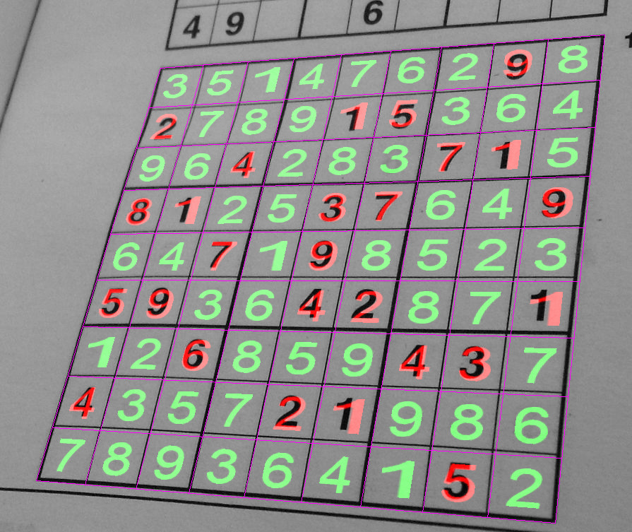

# sudoku
Sudoku solver from picture

This is a self-contained C++ program that tries to find a sudoku puzzle in an image and to solve it.
It doesn't depend on any external library (no very complex stuff involved)... the only external command needed is
`convert` (from [imagemagick](https://www.imagemagick.org)) if you want to input images in complex formats (`PGM` and `PPM` are
the only natively supported ones).

The code implements

- Image blurring using a recursive filter
- Local binarization
- Blob detection
- Corner detection
- Camera matrix computation
- Bilinear filtering
- Image mapping
- Distance transform
- Chamfer distance computation
- Backtracking sudoku solver

running the program with `--help` provides the list of options

